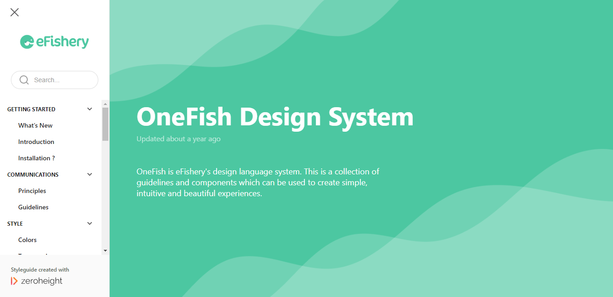

<h1> OneFish Design System </h1>

<h2> Design System </h2>

Design System adalah sebuah standarisasi lengkap yang dimaksudkan untuk mengelola desain dalam skala besar dengan menggunakan komponen dan pola yang dapat digunakan kembali.

Contoh:
- [Gojek](https://gojek.design/)
- [Jds_Jabar](https://www.figma.com/@jds_jabar)

Mengapa perlu menggunakan *Design System*?
- *Design* dan *development* dapat dibuat dan direplikasi dengan cepat dalam skala besar.
- Bisa lebih fokus pada masalah yang lebih besar dan kompleks.
- Menciptakan bahasa terpadu di dalam dan di antara tim lintas fungsi.
- Sebagai referensi junior level ke bawah. 
- Menciptakan konsistensi visual di seluruh produk, *channels* dan *(potentially siloed) departments*.

<h2> OneFish Design System </h2>

[OneFish Design System](https://zeroheight.com/5f5d88f53/p/75a5e7-onefish-design-system)

<h2> ReactJS as Basic </h2>

Steb by step:

1. Install Create React App
    
    Demo CRA (https://create-react-app.dev/docs/getting-started)
2. Install Chakra UI 
    
    Demo Chakra UI (https://chakra-ui.com/getting-started)
3. Install One Fish
    
    Demo One Fish (https://onefish.efishery.com/?story=getting-started)

