<h1> Reltional Database </h2>

Tugas : Buatlah query untuk membuat database seperti pada gambar di bawah ini. Setelah itu buat query untuk insert, update, delete di masing-masing table dn terapkan join di tabel order.

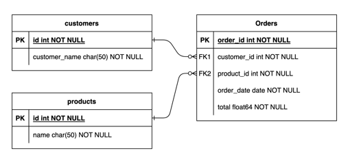

<h2> Create Database dan Table </h2>

* Membuat Database

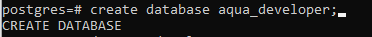
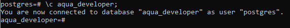

* Membuat Tabel

    * Tabel customers

        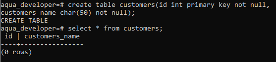
    * Tabel products

        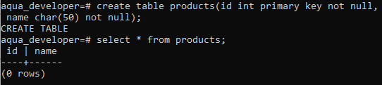
    * Tabel orders

        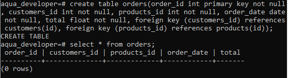

<h2> Insert </h2>

* Insert customers

    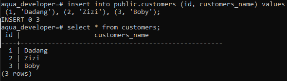
* Insert products

    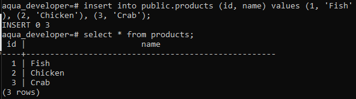
* Insert orders

    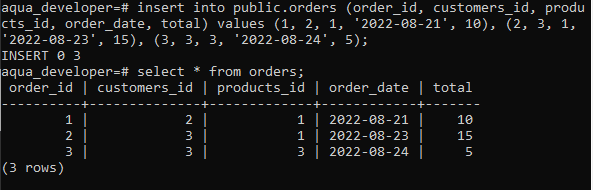

<h2> Update </h2>

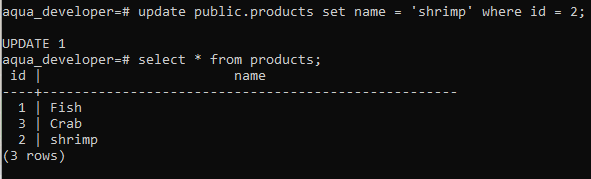
<h2> Delete </h2>

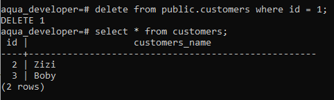
<h2> Join </h2>

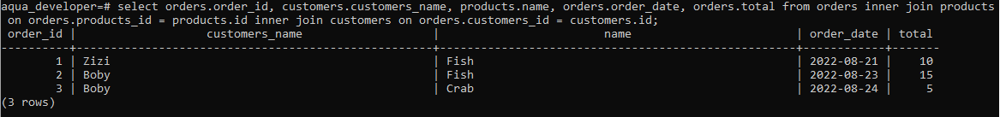
