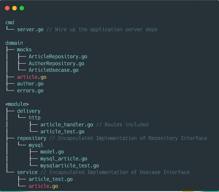

<h1> Advance Golang Part 3 </h1>

<h2> ORM (Object-Relational Mapping) </h2>

ORM adalah teknik yang memungkinkan untuk melakukan queri dan memanipulasi data dari database menggunakan paradigma berorientasi objek.

Proses Instalasi:
```
go get -u gorm.io/gorm
go get -u gorm.io/driver/postgres
```
Menghubungkan ORM dengan database terkhusus PostgreSQL yang berada di lokal:
```
import (
	"gorm.io/driver/postgres"
	"gorm.io/gorm"
)

dsn := "host=localhost port=5432 user=postgres dbname=postgres password=postgres sslmode=disable TimeZome=Asia/Jakarta"
db, err := gorm.Open(postgres.Open(dsn), &gorm.Config{})
```

<h2> Middleware </h2>

Middleware adalah sebuah blok kode yang dipanggil sebelum ataupun sesudah http request di proses.

> Misal kita punya sebuah app, middleware seolah-olah seperti membungkus app. Jadi semua request ke app kita yg lewat maupun respon pasti lewat middleware. Biasanya Middleware dimanfaatkan untuk autentifikasi, jadi di middleware ada proses validsai, bahwa apakah user ini memiliki hak akses ke app.

<h2> Environment Variables </h2>

Environment Variables adalah variabel yang berada di lapisan *runtime* os. Karena env var adalah variabel seperti biasa, kita dapat melakukan operasi seperti mengubah nilainya atau mengambil nilainya.

<h2> Clean Architecture </h2>

Clean Architecture adalah sebuah filosofi design software yang membuat sebuah software mudah untuk dipahami, dikembangkan dan di *maintenance*.Sering disebut sebagai ring level atau onion layer. Clean architecture digunakana agar ketika terjadi perubahan pada suatu layer tidak akan mempengaruhi layer lainnya.

Keuntungan menggunakan Clean architecture:
* Dapat diuji
* Dapat di maintenance
* Dapat diubah / *Changeable*
* Easy to Develop
* Easy to Deploy
* Independent -> karena dipisahkan per modul


Berikut merupakan tampilan struktur direktori pada clean architecture:



Beberapa bagian penting pada clean architecture:
* Delivery -> *Layer* yang akan bertugas sebagai presenter atau menjadi output dari aplikasi. Tugas lainnya ialah menjadi dinding penghubung antara user dan sistem.
* Repository -> *Layer* yang menyimpan database handler. Tidak ada business logic, yang ada hanya fungsi standard untuk input-output dari datastore.
* Service -> *Layer* yang akan bertugas sebagai pengontrol, yakni menangani bussiness logic dan bertugas memilih repository apa yang akan digunakan serta bisa memiliki lebih dari satu layer repository.