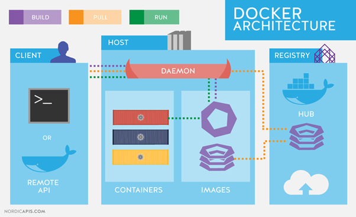
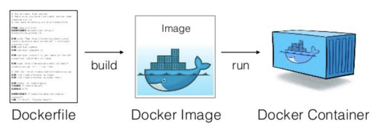

<h1> Cloud Native </h1>

Arsitektur dan teknologi cloud-native adalah pendekatan untuk merancang, membangun, dan mengoperasikan beban kerja yang dibangun di cloud dan memanfaatkan sepenuhnya model komputasi cloud.

Menurut definisi resmi sendiri cloud-native adalah suatu paradigma komputasi baru yang dioptimalkan untuk *modern distributed systems environments*, yang mampu menskalakan hingga puluhan ribu node yang memungkinkan *self-healing* dan multi tenant nodes.

Terdapat 5 pilar pada cloud-native:

<h2> The Twelve-Factor Application </h2>

12 Faktor penting dalam Software Development menjelaskan serangkaian prinsip dan praktek yang diikuti *developers* untuk membangun aplikasi yang dioptimalkan untuk *modern cloud environments*. 

<h3> 1. Codebase (One codebase tracked in revision control, many deploys) </h3>

Saat membangun sebuah aplikasi, kita harus menggunakan satu codebase yang dapat di jalankan di semua environment. Beberapa contoh penggunaan codebase adalah penggunaan git, svn ataupun version control lainnya. Sehingga kita tidak akan bekerja seperti zaman dahulu memakai flashdisk — copy — paste.

<h3> 2. Dependencies (Explicitly declare and isolate dependencies) </h3>

Software yang baik adalah software yang jelas dependencies management-nya. Sehingga saat proses deploy ke server manapun kita tidak mengalami kewalahan. Contohnya, seperti package.json pada NPM di NodeJs. Sehingga saat proses deploy, kita hanya tinggal menjalankan satu command npm install dan semua dependencies akan secara otomatis terinstall.

<h3> 3. Configuration (Store config in the environments) </h3>

    
Agar aplikasi bisa di-running di environment yang berbeda-beda, maka pada saat proses development, kita tidak boleh menempatkan konfigurasi aplikasi kita secara hardcode di source code aplikasi kita, melainkan memisahkannya ke dalam file yang berbeda berdasarkan environment yang dibutuhkan.

<h3> 4. Backing Service (Threat Backing Service as Attached Source) </h3>

Saat proses development aplikasi semua service yang terhubung dengan aplikasi kita harus kita perlakukan sebagai source yang dapat diganti dengan service sejenis. Jadi tidak bersifat tighly-coupled dan bergantung hanya pada satu source saja, melainkan dapat diganti dengan source yang berbeda.

<h3> 5. Build, Release, Run (Strictly separate build and run stages) </h3>

Saat membangun suatu aplikasi disarankan menggunakan Continuous Integration/Continuous Delivery (CI/CD) untuk automate build. Docker images merupakan salah satu tools yang dapat memberikan kemudahan untuk memisahkan build dan run stages.

<h3> 6. Processes (Execute the app as one or more stateless processes) </h3>

Aplikasi yang kita kembangkan harus bersifat stateless(tidak menyimpan state). Segala data harus disimpan di backing service, bukan di aplikasi. Termasuk cache, file, dsb yang ada pada aplikasi sebaiknya di simpan di backing service. Kita harus memastikan saat aplikasi mengalami restart, maka segala proses yang sebelumnya terjadi sudah clear dan tidak bersisa di disk ataupun di memori aplikasi.

<h3> 7. Port Binding (Export services via port binding) </h3>

Saat melakukan proses development kita perlu memilih beberapa port, maka aplikasi kita akan running di port tersebut sebagai service. 

<h3> 8. Concurrency (Scale out via the process model) </h3>

Ketika membangun aplikasi dengan concurrency yang tinggi, kita perlu mengatur concurrency tersebut dengan metode-metode seperti 'Horizontal Scale' sesuai dengan traffic aplikasi. Seiring dengan kenaikan traffic, maka aplikasi akan melakukan replicate untuk kebutuhan request yang besar.

<h3> 9. Disposability (Maximize robustness with fast startup and graceful shutdown) </h3>

Agar aplikasi kita tersebut fast start-up ketika di restart. Serta cepat dan aman saat shutdown (graceful shutdown).

<h3> 10. Dev/Prod Parity (Keep development, staging, and production as similar as possible) </h3>

Saat proses development aplikasi, kita harus mengurangi/meminimalisir Gap, seperti Time Gap, Personnel Gap, dan Tools Gap.
    
* Time Gap terjadi ketika programmer membangun aplikasi untuk direlease ke production membutuhkan waktu berminggu-minggu atau bahkan berbulan bulan.

* Personnel Gap terjadi ketika programmer membangun aplikasi tetapi yang melakukan proses deploy adalah DevOps yang tidak tahu-menahu tentang aplikasi. Sehingga dapat terjadi gap dan misunderstanding terkait beberapa config dan lain sebagainya.

* Tools Gap terjadi ketika programmer mengembangkan aplikasi menggunakan source atau tools yang berbeda di development stage dengan yang ada di production stage. Misalnya ketika mendevelop di local, kita menggunakan Mysql sebagai data store. Namun ketika release ke production, kita menggunakan PostgreSql.

Dengan continues deployment, gap yang terjadi dapat kita kurangi. Saat code dipush ke codebase (git), secara otomatis akan dilakukan running test dan deploying on everywhere.

<h3> 11. Logging (Treat logs as event streams) </h3>

Saat proses development dilocal, log tidak terlalu masalah jika diprint di stdout console saja. Namun saat sudah di production, kita harus menangani logs ini agar dapat di lihat bebas tanpa harus ssh ke terminal server.

<h3> 12. Admin Process (Run admin/management tasks as one-off processes) </h3>

Hal ini berkaitan dengan bagaimana kita me-manage task-task yang bersifat administratif dan banyak. Contoh pada Golang. Untuk proses build kita harus melakukan beberapa command. Untuk bisa melakukannya dengan satu proses saja, maka kita bisa menggunakan Makefile, dan hanya dengan command make maka semua yang perlu dilakukan telah selesai.

<h2> Containers </h2>

Containerization adalah abstraksi pada lapisan aplikasi yang mengemas kode dan dependensi bersama-sama.

Docker merupakan salah satu container yang berjalan secara local namun sangat cepat dibanding container lainnya.

Salah satu tujuan utama menggunakan Docker adalah containerization. Yaitu agar kita memiliki environment yang konsisten untuk aplikasi dan tidak bergantung kepada host machine tempat dimana aplikasi berjalan.

<h2> Docker Architecture </h2>

Docker merupakan sebuah tool yang berguna untuk membangun, mendeploy, dan menjalankan aplikasi dengan mudah melalui sebuah container. Container itu sendiri berguna untuk mengemas sebuah aplikasi dengan semua bagian yang dibutuhkannya, seperti libraries dan dependencies. Docker ini open source yang biasa digunakan untuk menyatukan beberapa file dalam sebuah program software.

Manfaat Docker -> Docker membuat developer lebih mudah untuk memodifikasi dan memperbarui program yang ada, mengirimkan kode lebih cepat, menstandardisasi operasi aplikasi, memindahkan kode dengan lancar, dan menghemat uang dengan meningkatkan pemanfaatan sumber daya. Tujuan digunakannya Docker adalah untuk membuat aplikasi menjadi portable dan simpel.

<h3> Arsitektur Docker </h3>

<h2> Important Terms in Docker World </h2>

* Docker Registry: Tempat *image* disimpan. Berisikan kumpulan Docker image yang dapat diakses melalui Docker hub. Melalui docker registry juga dapat menggunakan Docker image yang telah dibuat oleh developer lain.

* Dockerfile: File teks yang berisi semua perintah yang bisa dijalankan user pada baris perintah untuk membuat *image*. 

* Docker Image: Dasar template untuk Docker container. Berisi instruksi yang di-define pada file Dockerfile. Template yang bersifat read-only. Satu docker images dapat digunakan untuk membuat banyak docker container.

* Docker Container: Berada di atas *image*. Setiap perubahan yang disimpan pada container akan menyebabkan terbentuknya layer baru di atas base *image*. Docker container dibuat menggunakan Docker daemon.

* Docker Daemon: Berfungsi untuk membangun, mendistribusikan, dan menjalakan container Docker.

