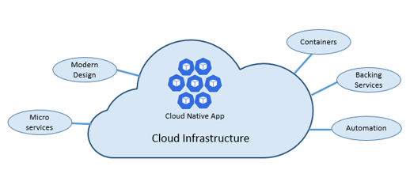

<h1> Cloud Native </h1>

Arsitektur dan teknologi cloud-native adalah pendekatan untuk merancang, membangun, dan mengoperasikan beban kerja yang dibangun di cloud dan memanfaatkan sepenuhnya model komputasi cloud.

Menurut definisi resmi sendiri cloud-native adalah suatu paradigma komputasi baru yang dioptimalkan untuk *modern distributed systems environments*, yang mampu menskalakan hingga puluhan ribu node yang memungkinkan *self-healing* dan multi tenant nodes.

Terdapat 5 pilar pada cloud-native:

<h2> The Twelve-Factor Application </h2>

